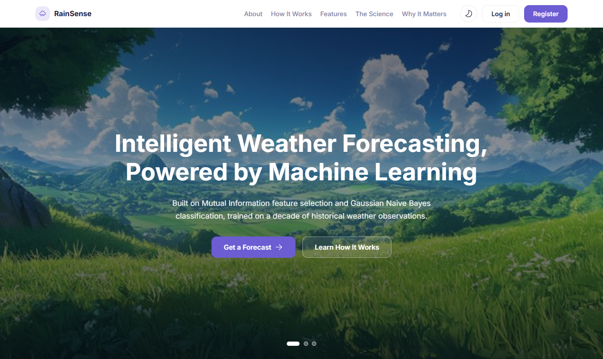
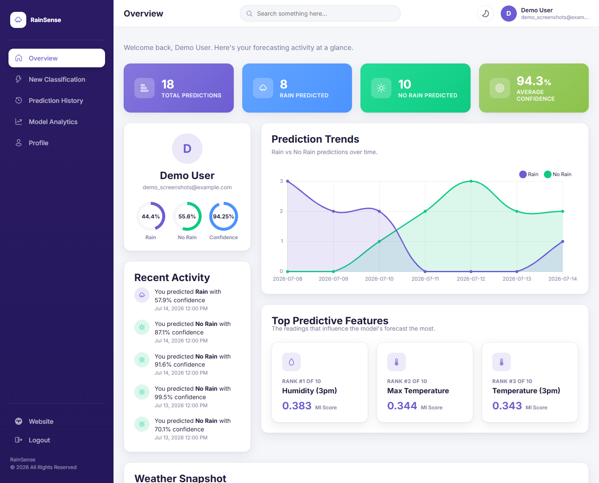
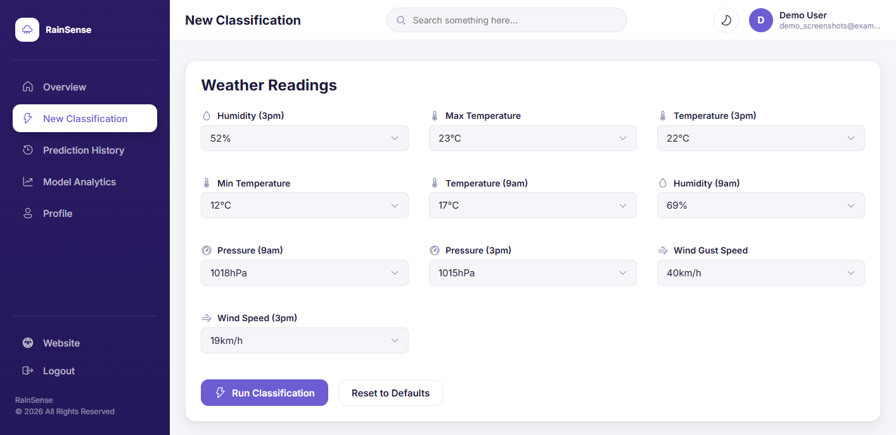
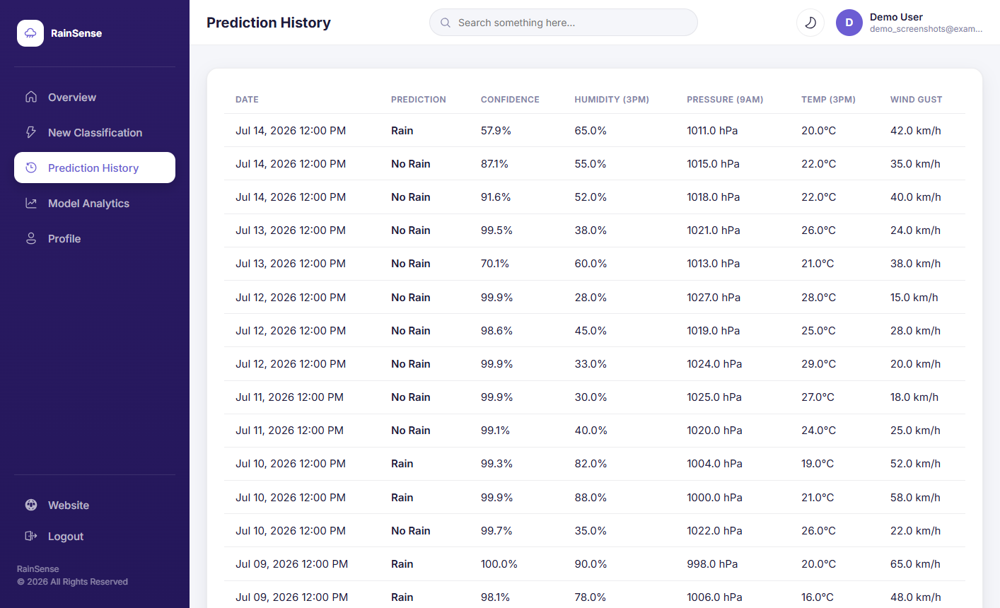
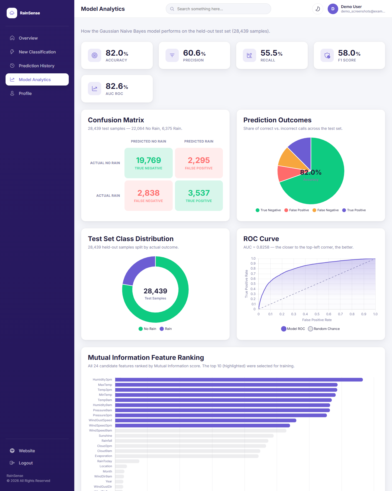
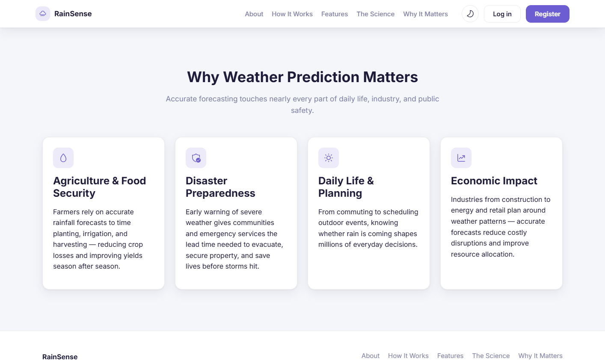

<div align="center">

# 🌧️ RainSense

**Intelligent next-day rain prediction, powered by Mutual Information feature selection and Gaussian Naive Bayes classification.**

A full-stack Flask web application that turns a machine learning research project into a real, usable product — register an account, enter today's weather readings, and get an instant Rain / No Rain forecast with a transparent, feature-by-feature explanation of *why* the model made that call.


</div>



---

## Table of Contents

- [What Is RainSense?](#what-is-rainsense)
- [Screenshots](#screenshots)
- [The Model](#the-model)
  - [Why Mutual Information?](#why-mutual-information)
  - [Why Gaussian Naive Bayes?](#why-gaussian-naive-bayes)
  - [Performance](#performance)
- [Key Features](#key-features)
- [Tech Stack](#tech-stack)
- [Project Structure](#project-structure)
- [Getting Started](#getting-started)
- [Usage Guide](#usage-guide)
- [Retraining the Model](#retraining-the-model)
- [License](#license)

---

## What Is RainSense?

RainSense answers one question: **will it rain tomorrow?**

It's built around a research pipeline that starts with raw historical weather data and ends with a lightweight, interpretable classifier that anyone can query in real time:

1. **Acquire** a decade of daily observations from the Australian Bureau of Meteorology (the `weatherAUS` dataset — 145,000+ records).
2. **Clean** the data — impute missing values, encode categorical variables, and correct class imbalance with SMOTE.
3. **Select features** using Mutual Information, keeping only the 10 readings that most reduce uncertainty about tomorrow's rainfall.
4. **Train** a Gaussian Naive Bayes classifier on those 10 features.
5. **Serve** it behind a full authentication system, a dropdown-driven classification form, prediction history, and a model analytics dashboard — so the research doesn't stay locked in a notebook.

## Screenshots

<table>
<tr>
<td width="50%">

**Dashboard Overview**


</td>
<td width="50%">

**New Classification**


</td>
</tr>
<tr>
<td width="50%">

**Prediction History**


</td>
<td width="50%">

**Model Analytics**


</td>
</tr>
</table>

**Landing page — Why Weather Prediction Matters**


## The Model

### Why Mutual Information?

Not every weather variable is equally useful for predicting rain. Mutual Information measures how much knowing one variable reduces uncertainty about another — in plain terms, *"if I know today's humidity, how much better can I guess tomorrow's rain?"*

Out of 24 candidate features in the raw dataset, the 10 that scored highest were kept for training:

| Rank | Feature | Rank | Feature |
|---|---|---|---|
| 1 | Humidity (3pm) | 6 | Humidity (9am) |
| 2 | Max Temperature | 7 | Pressure (9am) |
| 3 | Temperature (3pm) | 8 | Pressure (3pm) |
| 4 | Min Temperature | 9 | Wind Gust Speed |
| 5 | Temperature (9am) | 10 | Wind Speed (3pm) |

Features like `Location`, `WindDir`, and calendar fields (`Day`, `Month`, `Year`) scored low and were dropped — they add noise, not signal.

### Why Gaussian Naive Bayes?

Naive Bayes classifies by comparing probabilities: for each class (Rain / No Rain), it assumes every feature follows its own bell-curve (Gaussian) distribution, then combines how likely the observed readings are under each class. The "naive" part is the simplifying assumption that features are independent given the class — a trade-off that keeps the model fast, lightweight, and easy to explain, while still performing well in practice.

That interpretability is what powers the **feature contribution breakdown** on every prediction — RainSense shows exactly how much each reading pushed the model toward Rain or No Rain, ranked by influence.

### Performance

Evaluated on a held-out test set of **28,439 samples**:

| Metric | Score |
|---|---|
| Accuracy | 82.0% |
| Precision | 60.6% |
| Recall | 55.5% |
| F1 Score | 58.0% |
| AUC-ROC | 82.6% |

Full confusion matrix, ROC curve, and the complete 24-feature Mutual Information ranking are available live on the **Model Analytics** page.

## Key Features

- 🔐 **Accounts** — register/login with hashed passwords (Werkzeug), session-based auth via Flask-Login.
- ⚡ **Real-time classification** — a dropdown-driven weather reading form; no typos, no invalid values.
- 🔍 **Transparent predictions** — every forecast comes with a per-feature breakdown showing how each reading influenced the result.
- 📜 **Prediction history** — every classification is saved to your account and browsable with server-side pagination.
- 📊 **Model analytics** — confusion matrix, ROC curve, prediction-outcome breakdown, and the full Mutual Information feature ranking, all animated with Chart.js.
- 🏠 **Personal dashboard** — stat cards, a rain/no-rain/confidence ring summary, a prediction-trends chart, and a snapshot of your average weather readings.
- 🎨 **Light & dark themes** — a full design system that adapts to the user's preference.
- 🔔 **SweetAlert2 flash messages** — friendly toasts for login, logout, and classification actions, plus a themed loading animation while a prediction is processed.
- 👤 **Profile management** — update your name/email or change your password from the dashboard.

## Tech Stack

**Backend**
- [Flask](https://flask.palletsprojects.com/) — application framework
- [Flask-Login](https://flask-login.readthedocs.io/) — session management
- [Flask-WTF](https://flask-wtf.readthedocs.io/) — form handling & validation
- SQLite — lightweight per-user data storage

**Machine Learning**
- [scikit-learn](https://scikit-learn.org/) — `GaussianNB`, `mutual_info_classif`
- [imbalanced-learn](https://imbalanced-learn.org/) — SMOTE oversampling
- [pandas](https://pandas.pydata.org/) / [NumPy](https://numpy.org/) — data processing

**Frontend**
- Vanilla HTML/CSS/JS (no build step, no framework)
- [Chart.js](https://www.chartjs.org/) — analytics visualizations
- [SweetAlert2](https://sweetalert2.github.io/) — flash messages & loading states
- Inline [Fluent UI System Icons](https://github.com/microsoft/fluentui-system-icons)

## Project Structure

```
weatherPrediction_app/
├── app/
│   ├── ml/
│   │   ├── artifacts/          # model.pkl, metrics.json, mi_scores.json
│   │   └── predictor.py        # inference + input validation
│   ├── routes/                 # main / auth / dashboard blueprints
│   ├── static/
│   │   ├── css/                # theme.css, dashboard.css, landing.css, ...
│   │   ├── img/                # favicon, hero images
│   │   └── js/                 # per-page JS (no bundler)
│   ├── templates/               # Jinja2 templates
│   ├── forms.py                 # WTForms definitions
│   ├── models.py                # User model + SQLite access
│   └── __init__.py              # app factory
├── docs/screenshots/            # README screenshots
├── config.py                    # app configuration
├── run.py                       # entry point (flask run equivalent)
├── train_model.py               # reproduces the training pipeline
├── requirements.txt
└── README.md
```

## Getting Started

### Prerequisites

- Python 3.12+
- pip

### Installation

```bash
# 1. Clone the repository
git clone https://github.com/Animichael/weather_classification_model.git
cd weather_classification_model

# 2. Create and activate a virtual environment
python -m venv venv
venv\Scripts\activate        # Windows
source venv/bin/activate     # macOS/Linux

# 3. Install dependencies
pip install -r requirements.txt

# 4. Run the app
python run.py
```

The app will be available at **http://127.0.0.1:5000**.

## Usage Guide

1. **Register an account** from the landing page (or log in if you already have one).
2. Go to **New Classification**, select today's weather readings from the dropdowns, and hit **Run Classification**.
3. Watch the loading animation while the model extracts patterns from your inputs, then review:
   - The Rain / No Rain verdict with a confidence gauge.
   - The probability split between both classes.
   - A ranked breakdown of which readings pushed the decision, and in which direction.
4. Every prediction is automatically saved — browse them anytime from **Prediction History**.
5. Visit **Model Analytics** to see how the underlying model performs on the full held-out test set.
6. Update your name, email, or password anytime from **Profile**.

## Retraining the Model

The training pipeline is reproducible from the command line:

```bash
python train_model.py --data-path path/to/weatherAUS.csv
```

This regenerates `app/ml/artifacts/model.pkl`, `metrics.json`, and `mi_scores.json` — the exact artifacts the app loads at runtime.

## License

This project was developed as a BSc research project. See the repository for license details, or contact the author for reuse permissions.

---

<div align="center">

Built with 🌦️ by [Animichael](https://github.com/Animichael)

</div>
